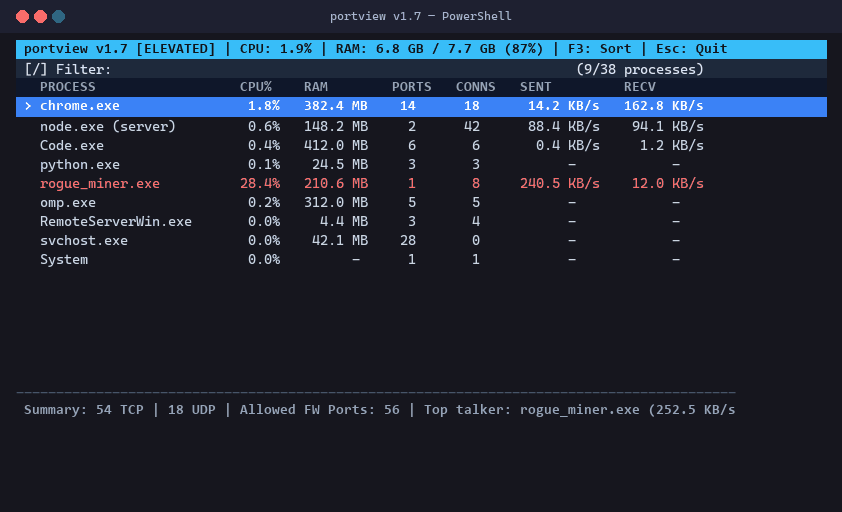

# portview

> **The TUI `netstat` alternative that also manages your Windows Firewall.**  
> See what's listening, then allow or block that port with one keystroke — no MMC snap-in, no wizards, no dependencies.

[](https://github.com/mrun1corn/portview)
[](https://github.com/mrun1corn/portview)
[](LICENSE)
[](https://github.com/mrun1corn/portview)
[](https://github.com/mrun1corn/portview/releases/latest)
[](https://github.com/mrun1corn/portview/releases)
[](https://github.com/mrun1corn/portview)
[](https://github.com/mrun1corn/portview/actions/workflows/release.yml)
[](https://github.com/mrun1corn/portview/actions/workflows/ci.yml)


<p align="center">
  
</p>

---

## Quick Install

Download and run — **no administrator rights required**.

```powershell
# Works immediately as a normal user
Invoke-WebRequest -Uri "https://github.com/mrun1corn/portview/releases/latest/download/portview.exe" -OutFile "portview.exe"; .\portview.exe
```

Optionally move it onto your `PATH` so you can run it from any directory:

```powershell
Move-Item .\portview.exe "$env:USERPROFILE\bin\portview.exe"
$env:PATH += ";$env:USERPROFILE\bin"
```

> [!TIP]
> **Optional: elevate for the full feature set.** Running your terminal as Administrator unlocks per-socket bandwidth telemetry (`SENT` / `RECV`), elevated system process path resolution, and firewall rule creation/toggling. Port enumeration, live search, sorting, and process inspection work fully without it.
>
> To get it: right-click your terminal $\rightarrow$ *Run as administrator*, then launch `portview.exe` again.

---

## Why PortView?

Configuring a Windows Firewall port rule means launching **Windows Defender Firewall with Advanced Security**, clicking through the Inbound Rules pane, creating a new rule, picking TCP, entering a port, selecting "Allow the connection", naming it, and clicking through four more wizards.

PortView removes that entirely. It shows you what's actually running and listening, then lets you **allow or block that port without ever leaving the terminal.**

| Task | PortView | Windows Firewall MMC | `netsh advfirewall` |
| :--- | :--- | :---: | :---: |
| **Allow a port** | <kbd>F2</kbd> in a live list | ❌ 6–8 wizard clicks | ❌ Long command string |
| **Block a port** | <kbd>F4</kbd> one-key toggle | ❌ Manual rule creation | ❌ Long command string |
| **See what owns a port first** | ✅ Live socket table | ❌ Unrelated tool | ❌ Unrelated tool |
| **Firewall rule status** | ✅ <kbd>ALLOW</kbd>/<kbd>BLOCK</kbd> badge per row | ⚠️ Separate window | ❌ Not shown |
| **Reverse DNS** | ✅ Async, never blocks | ❌ n/a | ❌ n/a |

### Also does

| Feature | `portview` | `netstat -ano` | Sysinternals `TCPView` | Resource Monitor |
| :--- | :---: | :---: | :---: | :---: |
| **Interface** | **Interactive TUI** | Static dump | Legacy GUI window | Heavy GUI dashboard |
| **Live type-to-filter** | ✅ Instant | ❌ grep only | ⚠️ Basic text box | ⚠️ Checkboxes |
| **Dynamic column sorting** | ✅ Click & <kbd>F3</kbd>/<kbd>F5</kbd> | ❌ None | ✅ Clickable headers | ⚠️ Limited |
| **Native mouse support** | ✅ Clicks & wheel | ❌ None | ✅ Yes | ✅ Yes |
| **External dependencies** | ✅ **Zero** | ✅ Zero | ⚠️ Requires Sysinternals | ✅ Built-in |
| **Per-process CPU% & RAM** | ✅ Live with EMA | ❌ No | ❌ No | ✅ Yes |
| **Per-connection bandwidth** | ✅ Elevated, TCP | ❌ No | ❌ No | ⚠️ Aggregate only |
| **Kill process on port** | ✅ <kbd>Del</kbd> | ❌ `taskkill` | ✅ Menu | ✅ Context menu |
| **Flicker-free redraw** | ✅ Full-frame writes | ❌ Screen clearing | ⚠️ Periodic blink | N/A |
| **Scriptable snapshot mode** | ✅ `--static` | ✅ Output dump | ❌ GUI only | ❌ GUI only |

---

## Features

### 🛡️ Firewall control — the point of the tool

- **One-key allow/block**: select a port, press <kbd>F4</kbd> to toggle its rule between allowed and blocked. No wizards, no dialogs.
- **Instant rule creation**: <kbd>F2</kbd> (or right-click) opens a modal prefilled with the selected process name and executable path. Enter `8080`, `80,443`, or `3000-3010` and it's committed to Windows Firewall via COM.
- **Live status badges**: every row carries an <kbd>ALLOW</kbd>/<kbd>BLOCK</kbd> indicator read from the actual firewall policy, so you can see what's exposed at a glance.
- **Rule list merged into the socket view**: firewall rules for processes with no current connections still appear (marked <kbd>IDLE</kbd>) — so stale rules don't hide.
- **Validated input**: ports must be `1`–`65535`; range expansion is capped at 1,024 ports per rule to prevent pathological allocations.

### 🔍 Live network view

- **Default live search**: starts in type-to-filter mode instantly. Filter by process name, PID, port, or connection state.
- **Dynamic column sorting**: click any header, or use <kbd>F3</kbd>/<kbd>F5</kbd>, to sort by Name, CPU%, RAM, Conns, Ports, or Traffic.
- **Full native mouse support**: wheel scrolling, row selection, double-click drill-down, right-click context actions.
- **Live CPU & RAM per process**: working-set RAM and CPU% deltas, stabilized with an exponential moving average (EMA) so numbers don't jitter.
- **Per-connection bandwidth**: live sent/receive byte rates per TCP socket via the Windows Extended TCP Statistics API, plus top-talker ranking.
- **Process management**: terminate a process directly (<kbd>Del</kbd>/<kbd>F8</kbd>, with confirmation) and copy details to the clipboard (<kbd>Ctrl+C</kbd>).

### Under the hood

- **Flicker-free rendering**: every frame is composed in memory and written to the console in a single call, so redraws don't strobe.
- **Memory-safe by construction**: bounded caches, dead-connection and dead-PID pruning, single-flight async firewall refresh with a joined shutdown, and RAII console-mode/cursor restoration (including on <kbd>Ctrl+C</kbd>).
- **Zero external dependencies**: standard Windows SDK APIs only (`iphlpapi`, `ws2_32`, `ole32`, `psapi`) with a static CRT (`/MT`) — the `.exe` runs on any Windows 10/11 box with no redistributable.

---

## Example Output

```text
========================================================================================
portview v1.7 [ELEVATED] | CPU: 2.1% | RAM: 6.8 GB / 7.7 GB (87%) | F3: Sort | Esc: Quit
========================================================================================
[/] Filter: chrome                                                        (1/39 processes)
   PROCESS                  CPU%    RAM        PORTS   CONNS   SENT v       RECV
 > chrome.exe               1.2%    232.6 MB   7       14      12.4 KB/s    156.2 KB/s
   python.exe               0.0%    18.5 MB    6       6       -            -
   Code.exe                 0.4%    435.1 MB   5       5       -            -
----------------------------------------------------------------------------------------
Summary: 30 TCP | 8 UDP | Allowed FW Ports: 12 | Top talker: chrome.exe (168.6 KB/s)
```

> **Note:** the `SENT` / `RECV` columns populate only for TCP sockets when running elevated. UDP listeners and non-elevated sessions show `-`. Refresh interval is 1.5s; the banner reports whole-system CPU and RAM.

---

## Controls

### Mouse

| Action | Gesture |
| :--- | :--- |
| Select row | Left click |
| Drill down / toggle rule | Double click |
| Sort column | Left click on the header row |
| Open Add Rule modal | Right click on a row |
| Scroll | Mouse wheel (3 rows per notch) |
| Clear filter | Left click `[Clear]` |

### Keyboard

| Key | Function |
| :--- | :--- |
| *any character* | Live search / filter |
| <kbd>Backspace</kbd> | Delete last filter character; if already empty, go back to Summary |
| <kbd>Esc</kbd> | Clear filter → close modal → quit |
| <kbd>Enter</kbd> | Drill down into the selected process |
| <kbd>↑</kbd> / <kbd>↓</kbd> | Move selection |
| <kbd>PgUp</kbd> / <kbd>PgDn</kbd> | Move selection one page |
| <kbd>Home</kbd> / <kbd>End</kbd> | Jump to first / last row |
| <kbd>F2</kbd> / <kbd>Tab</kbd> | Open Add Firewall Rule modal |
| <kbd>F3</kbd> | Cycle sort column |
| <kbd>F4</kbd> | Toggle the selected port's firewall rule |
| <kbd>F5</kbd> | Reverse sort direction |
| <kbd>Del</kbd> / <kbd>F8</kbd> | Terminate process (Summary) or delete custom firewall rule / terminate socket (Detail) |
| <kbd>Ctrl+C</kbd> | Copy selected row to clipboard |

---

## FAQ

<details>
<summary><b>How do I open a port in Windows Firewall without the MMC snap-in?</b></summary>

Run PortView, select the process that owns the port, press <kbd>F2</kbd>, and enter the port. The rule is created and committed to Windows Firewall immediately — no "Advanced Security" window, no wizard, no rule name to invent.
</details>

<details>
<summary><b>How do I block a port instead of allowing it?</b></summary>

In the rule-creation modal, toggle Allow/Block with <kbd>F2</kbd> before committing. For an existing rule, select the port and press <kbd>F4</kbd> to flip it between allowed and blocked.
</details>

<details>
<summary><b>How do I find out what's listening on port 8080?</b></summary>

Type `8080` and the view filters down to the owning process, PID, and connection state. Press <kbd>Enter</kbd> or double-click to see its individual sockets.
</details>

<details>
<summary><b>How do I kill whatever is holding a port, without Task Manager?</b></summary>

Select the process row and press <kbd>Del</kbd> or <kbd>F8</kbd>. A safety confirmation dialog appears; press <kbd>Y</kbd> to terminate. All associated process instances are terminated, dead PIDs are evicted from cache, and the process vanishes immediately from your view.
</details>

<details>
<summary><b>Can I delete firewall rules from PortView?</b></summary>

Yes. In the socket detail view (<kbd>Enter</kbd>), highlight any custom PortView rule (including dormant rules marked <kbd>IDLE</kbd>) and press <kbd>Del</kbd> to delete it directly from Windows Firewall via COM. Windows built-in system rules and third-party application rules are protected from accidental deletion.
</details>

<details>
<summary><b>Can I see firewall rules for programs that aren't running right now?</b></summary>

Yes. In the socket detail view, rules belonging to programs with no active connections are surfaced, marked <kbd>IDLE</kbd>, so stale rules and leftover allowances stay visible instead of silently hiding.
</details>

<details>
<summary><b>Why do I need Administrator for firewall and bandwidth features?</b></summary>

Windows requires elevation to query Extended TCP Statistics (`SetPerTcpConnectionEStats` / `GetPerTcpConnectionEStats`) and to write firewall policy. Without it you still get complete port mapping, process resolution, live search, sorting, and CPU/RAM.
</details>

<details>
<summary><b>Does it support IPv6?</b></summary>

Not yet — enumeration currently covers IPv4 only (`AF_INET`). IPv6 is tracked as a TODO.
</details>

<details>
<summary><b>What are the port syntax rules?</b></summary>

Single ports (`8080`), comma lists (`80,443,8080`), and ranges (`3000-3010`). Range expansion is capped at 1,024 ports per rule to avoid pathological allocations, and ports must be `1`–`65535`.
</details>

---

## Build from Source

**Requirements:** Windows 10/11, CMake 3.15+, MSVC (Visual Studio 2019+ or C++ Build Tools).

```powershell
git clone https://github.com/mrun1corn/portview.git
cd portview
cmake -B build -DCMAKE_BUILD_TYPE=Release -DPORTVIEW_BUILD_TESTS=ON
cmake --build build --config Release
```

The standalone executable lands at `build/Release/portview.exe`, statically linked against the MSVC runtime (`/MT`) — no extra DLLs or VC++ Redistributable required.

### Tests

```powershell
ctest --test-dir build -C Release --output-on-failure
```

The suite covers firewall port adding & validation, rule deletion & toggling, process termination & privilege checks, and string/network conversion utilities across four standalone test targets. CI additionally smoke-tests the CLI (`--version`, `--help`, `--static`) on every push and pull request.

---

## Architecture

A modular monolith: four decoupled domain subsystems behind singleton facades.

```text
portview/
├── CMakeLists.txt
├── include/
│   ├── core/          data_models.h · system_metrics.h · utils.h
│   ├── network/       network_scanner.h · process_resolver.h
│   ├── security/      firewall_manager.h
│   └── ui/            terminal_screen.h · search_filter.h · components.h · app_controller.h
├── src/
│   ├── core/          system_metrics.cpp · utils.cpp
│   ├── network/       network_scanner.cpp · process_resolver.cpp
│   ├── security/      firewall_manager.cpp
│   ├── ui/            app_controller.cpp · components.cpp · search_filter.cpp · terminal_screen.cpp
│   └── main.cpp       CLI entrypoint & RAII init
├── resources/         portview.ico · resource.rc
├── tests/             test_port_adding.cpp · test_rule_deletion.cpp · test_kill_process.cpp · test_string_utils.cpp
└── .github/workflows/ ci.yml · release.yml
```

**Key implementation notes:**
- `network/` — `GetExtendedTcpTable` / `GetExtendedUdpTable` enumeration, Extended TCP Statistics for bandwidth, bounded DNS cache, and a `prevBytesMap_` keyed per-socket with dead-key pruning.
- `security/` — `NetFwPolicy2` COM wrapper with an explicit `ValidatePortRange` guard before anything reaches `put_LocalPorts`, plus single-flight async cache refresh.
- `core/` — CPU/RAM via `GetSystemTimes` and `GetProcessMemoryInfo`, EMA smoothing, and dead-PID pruning.
- `ui/` — the event loop. Frames are built into a `std::string` and flushed in one `std::cout.write`, with an RAII guard that restores console mode and cursor state on any exit path.
- Builds with `/W4 /WX /sdl /permissive-` and the static CRT (`/MT`).

---

## Contributing

Issues, bug reports, and PRs are welcome — see [CONTRIBUTING.md](CONTRIBUTING.md). For security disclosures, read [SECURITY.md](SECURITY.md).

---

## License

MIT — see [LICENSE](LICENSE).
